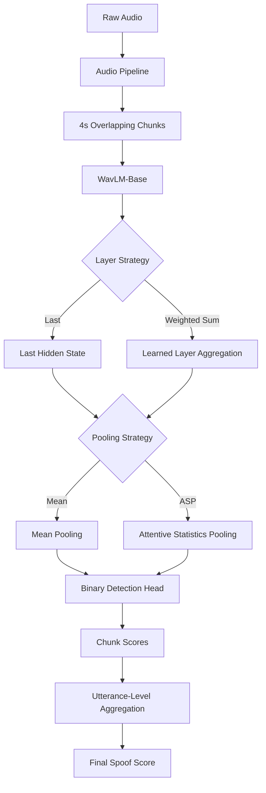

<div align="center">

# 🎙️ Vaak

### *an ear that's trained to notice.*

**Research-first synthetic speech & voice deepfake detection**

[](CHANGELOG.md)
[](https://www.python.org/downloads/)
[](https://pytorch.org/)
[](https://mlflow.org/)
[](https://github.com/astral-sh/ruff)
[](https://pytest.org/)

</div>

---

## 📖 Overview

**Vaak** (वाक्)  is a modular, research-first deep learning system for detecting **synthetic speech and voice deepfakes**.

At its core, the task is binary:

> **Is this speech bonafide or synthetic?**

But reliable speech deepfake detection is more difficult than achieving high accuracy on a familiar dataset. A detector can perform extremely well on known attacks while relying on artifacts specific to a particular generator, dataset, codec, or recording condition.

Vaak therefore treats **generalization as a first-class objective**.

The project follows a controlled research loop:

```text
Hypothesis
    ↓
Controlled experiment
    ↓
Reproducible training
    ↓
Utterance-level evaluation
    ↓
EER / minDCF / AUC
    ↓
Per-attack diagnostics
    ↓
Error analysis
    ↓
Keep / reject the hypothesis
````

The long-term goal is to evolve Vaak from a research benchmark into a usable forensic system capable of answering not only:

> **"Is this voice synthetic?"**

but eventually:

> **"How strong is the evidence, and where in the recording does it occur?"**

---

# 🎯 Research Philosophy

Vaak intentionally does **not** begin with the largest or most complicated architecture possible.

Instead, the project builds complexity gradually.

### The rule

> **One meaningful architectural change at a time.**

For example:

```text
WavLM + Mean
      ↓
WavLM + ASP
      ↓
WavLM + Layer Aggregation + Mean
      ↓
WavLM + Layer Aggregation + ASP
      ↓
only then → stronger backbones / temporal models / fine-tuning
```

This makes it possible to determine **which component actually helps** rather than building a complicated model whose improvement or failure cannot be explained.

The project also prioritizes:

* cross-attack generalization
* cross-corpus evaluation
* robustness to degraded audio
* reproducibility
* calibrated predictions
* inference latency
* transparent error analysis

---

# 🧠 Current Model

The current research backbone is **WavLM-Base**.

A 4-second audio segment sampled at 16 kHz contains:

```text
4 × 16,000 = 64,000 samples
```

The waveform is passed through WavLM and becomes a sequence of learned representations:

```text
[B, 64,000]
      ↓
    WavLM
      ↓
[B, T, 768]
```

where:

* `B` = number of audio examples processed together
* `T` = temporal feature positions produced by WavLM
* `768` = WavLM-Base hidden feature dimension

The current architecture supports two independent research choices.

### Layer extraction

```text
Last Hidden Layer
```

or

```text
All Hidden States
        ↓
Learned Weighted Layer Aggregation
```

### Temporal pooling

```text
Global Mean Pooling
```

or

```text
Attentive Statistics Pooling (ASP)
```

This gives the current 2×2 research matrix:

|                                | Global Mean |    ASP |
| ------------------------------ | ----------: | -----: |
| **Last Hidden Layer**          |      EXP-01 | EXP-02 |
| **Weighted Layer Aggregation** |      EXP-03 | EXP-04 |

---

# 🏗️ Architecture



### Research-time tensor flow

For a training batch:

```text
[B, 64,000]
      ↓
WavLM
      ↓
[B, T, 768]
      ↓
Mean / ASP
      ↓
[B, 768]       # Mean
or
[B, 1536]      # ASP
      ↓
Linear(..., 2)
      ↓
[B, 2]
```

For evaluation:

```text
One audio file
      ↓
4s windows with 2s hop
      ↓
[K, 64,000]
      ↓
model each chunk
      ↓
K chunk scores
      ↓
aggregate
      ↓
ONE utterance-level score
```

This separation is important: **training samples are fixed-size, while evaluation preserves the full utterance.**

---

# 🔬 Controlled Experiments

Vaak currently uses a deliberately small ablation matrix.

## EXP-01 — Baseline

```text
WavLM-Base
    ↓
Last Hidden Layer
    ↓
Global Mean Pooling
    ↓
Linear(768 → 2)
```

**Question:** What can a simple frozen WavLM representation achieve?

---

## EXP-02 — Pooling

```text
WavLM-Base
    ↓
Last Hidden Layer
    ↓
Attentive Statistics Pooling
    ↓
Linear(1536 → 2)
```

**Question:** Does learned temporal attention + statistics improve detection over simple averaging?

---

## EXP-03 — Layer Representation

```text
WavLM-Base
    ↓
All Hidden States
    ↓
Learned Weighted Layer Aggregation
    ↓
Global Mean Pooling
    ↓
Linear(768 → 2)
```

**Question:** Does information from intermediate WavLM layers improve spoof detection?

---

## EXP-04 — Combined

```text
WavLM-Base
    ↓
All Hidden States
    ↓
Learned Weighted Layer Aggregation
    ↓
Attentive Statistics Pooling
    ↓
Linear(1536 → 2)
```

**Question:** Is there a useful interaction between multi-layer representation learning and attentive temporal pooling?

---

# 📊 Evaluation

Vaak does not treat accuracy as the primary success criterion.

The main metrics are:

### Equal Error Rate — EER

Measures the operating point where false acceptance and false rejection rates are equal.

**Lower is better.**

### Detection Cost

Used to evaluate the trade-off between misses and false alarms.

**Lower is better.**

### ROC-AUC

Measures ranking/discrimination ability across thresholds.

**Higher is better.**

---

## Attack-level diagnostics

Overall performance can hide serious weaknesses.

Vaak therefore preserves spoofing-system metadata such as:

```text
A01
A02
...
A19
```

and produces attack-level diagnostics.

This makes it possible to answer:

```text
Does the model improve overall?
        ↓
Which attacks improved?
        ↓
Which attacks became worse?
        ↓
Does the improvement generalize?
```

For example, two architectures may have similar overall performance while behaving very differently on individual attack systems.

---

# 🧪 Dataset

The first benchmark integrated into Vaak is:

> **ASVspoof 2019 Logical Access (LA)**

The LA task is directly relevant to synthetic speech, including text-to-speech and voice-conversion spoofing.

Vaak converts the original ASVspoof protocol files into a canonical manifest containing:

```text
sample_id
audio_path
label
speaker_id
dataset
split
attack_id
```

Labels are normalized as:

```text
0 → bonafide
1 → spoof
```

and spoofing-system metadata is retained as `attack_id`.

### Current dataset flow

```text
ASVspoof protocol
        ↓
ASVspoof2019LAAdapter
        ↓
Canonical Vaak manifest
        ↓
Training / validation / evaluation datasets
```

The official ASVspoof train/dev/evaluation partitions are preserved rather than randomly rebuilding the benchmark split.

---

# 🎧 Audio Pipeline

The canonical audio preprocessing path is:

```text
Audio file
    ↓
Load
    ↓
Mono
    ↓
Float32
    ↓
16 kHz
    ↓
Normalization
    ↓
4-second chunking
    ↓
2-second hop
```

The current model-facing chunk is:

```text
64,000 samples
```

for 4-second audio at 16 kHz.

### Training

Training uses one randomly selected fixed-length chunk per utterance:

```text
Full recording
      ↓
4s chunks
      ↓
random chunk
      ↓
[64,000]
```

### Evaluation

Evaluation retains all deterministic overlapping chunks:

```text
Full recording
      ↓
4s window / 2s hop
      ↓
[K, 64,000]
      ↓
model each chunk
      ↓
aggregate
      ↓
utterance score
```

This prevents the evaluation pipeline from reducing an utterance to only its first few seconds.

---

# 🧪 Reproducible Experiment Tracking

Vaak uses **MLflow** to track experiments.

Each run records parameters such as:

```text
model
pretrained backbone
layer strategy
pooling strategy
sample rate
chunk duration
hop duration
batch size
learning rate
weight decay
epochs
device
```

and metrics such as:

```text
EER
normalized detection cost
AUC
per-attack metrics
```

Artifacts can include:

```text
checkpoints
configuration
training curves
attack-level plots
evaluation outputs
```

The goal is for every experiment to answer:

> **What exactly did I run, and what happened?**

---

# 📈 Current Experimental Results

The first baseline experiments demonstrated an important result:

> Increasing architectural complexity does **not** automatically improve unseen-attack detection.

An early WavLM-Base baseline using last-layer mean pooling achieved approximately:

```text
EER     16.13%
AUC      0.906
minDCF   0.329
```

A richer configuration using learned layer aggregation + ASP produced:

```text
EER     18.81%
AUC      0.882
minDCF   0.553
```

These results are treated as **experimental observations rather than final benchmark claims** while the utterance-level evaluation pipeline is being finalized and rerun under the corrected full-utterance protocol.

The interesting observation is that the richer architecture did not fail uniformly.

For example, attack-level analysis showed large changes in individual spoofing systems:

```text
A17
Baseline          0.393
Aggregation+ASP   0.426

A18
Baseline          0.284
Aggregation+ASP   0.186
```

This suggests that architectural changes can alter **which spoofing mechanisms the detector recognizes**, rather than simply making the detector globally better or worse.

That behavior is a central research question for Vaak.

---

# 🧪 Development Status

### ✅ Implemented

* Project structure and Python packaging
* `uv` environment management
* Python 3.12
* Ruff
* mypy
* pytest
* Makefile development workflow
* Typed configuration with YAML + Pydantic
* Audio loading and preprocessing
* Mono conversion
* Resampling
* Normalization
* Fixed-size audio chunking
* Canonical manifest schema
* Speaker-aware dataset abstractions
* ASVspoof 2019 LA adapter
* Training dataset
* Utterance-level evaluation dataset
* WavLM-Base encoder
* Dynamic encoder dimensions
* Mean pooling
* Attentive Statistics Pooling
* Learned WavLM layer aggregation
* Modular model factory
* Binary classification head
* Training loop
* Validation/checkpointing
* EER evaluation
* Detection-cost evaluation
* AUC evaluation
* Per-attack diagnostics
* MLflow experiment tracking

### 🚧 In active research

* Correct full-utterance benchmark reruns
* Controlled WavLM ablation study
* Attack-level error analysis
* Robustness/generalization analysis

### 🔜 Planned

* Fine-tuning and parameter-efficient adaptation
* Stronger anti-spoofing architectures
* Cross-corpus evaluation
* Acoustic degradation/codec robustness
* Production inference API
* Web interface
* Temporal deepfake localization
* Calibration
* Production deployment

---

# 🗂️ Project Structure

```text
vaak/
│
├── configs/
│   └── experiments/
│       ├── exp01_last_mean.yaml
│       ├── exp02_last_asp.yaml
│       ├── exp03_weighted_mean.yaml
│       └── exp04_weighted_asp.yaml
│
├── data/
│   ├── raw/
│   │   └── LA/
│   ├── manifests/
│   │   └── asvspoof2019_la.csv
│   └── processed/
│
├── src/
│   └── vaak/
│       ├── audio/
│       │   ├── loader.py
│       │   ├── preprocessing.py
│       │   ├── chunking.py
│       │   └── pipeline.py
│       │
│       ├── config/
│       │   └── settings.py
│       │
│       ├── core/
│       │   └── logging.py
│       │
│       ├── data/
│       │   ├── dataset.py
│       │   ├── training_dataset.py
│       │   ├── evaluation_dataset.py
│       │   ├── manifest.py
│       │   ├── splits.py
│       │   └── adapters/
│       │       └── asvspoof2019.py
│       │
│       ├── evaluation/
│       │   ├── evaluator.py
│       │   └── metrics.py
│       │
│       ├── models/
│       │   ├── factory.py
│       │   ├── detector.py
│       │   ├── encoders/
│       │   │   └── wavlm.py
│       │   ├── backends/
│       │   │   ├── aggregation.py
│       │   │   └── pooling.py
│       │   └── heads/
│       │       └── binary.py
│       │
│       ├── training/
│       │   └── trainer.py
│       │
│       └── utils/
│           ├── tracker.py
│           └── visualization.py
│
├── tests/
│   ├── fixtures/
│   ├── audio/
│   ├── data/
│   ├── evaluation/
│   ├── models/
│   └── integration/
│
├── scripts/
│   └── train.py
│
├── checkpoints/
├── mlruns/
├── Makefile
├── pyproject.toml
└── README.md
```

---

# 🚀 Quick Start

## 1. Clone

```bash
git clone https://github.com/yourusername/vaak.git
cd vaak
```

## 2. Install

Install [`uv`](https://docs.astral.sh/uv/) and synchronize the project environment:

```bash
uv sync
```

Activate the environment if desired:

```bash
source .venv/bin/activate
```

---

## 3. Run checks

Run formatting, linting, type checking and tests:

```bash
make check
```

Useful individual commands:

```bash
make test
make lint
make lint-fix
make format
make typecheck
```

---

## 4. Run the Application (Full Stack, Frontend, or Backend)

Vaak provides an interactive forensic listening console powered by a React + Vite frontend and a FastAPI backend inference engine.

### 🌐 Full-Stack Development (Recommended)

To start both the API inference server (`:8000`) and the Vite frontend (`:5173`) concurrently:

```bash
make dev
```

Once running, navigate to:
* **Forensic Listening Console**: `http://localhost:5173`
* **Interactive API Documentation (Swagger)**: `http://localhost:8000/docs`

### 🖥️ Run Frontend Only

If you only want to work on or preview the UI:

```bash
make frontend
```
*(Or `npm --prefix src/vaak/frontend run dev`)*

### ⚙️ Run Backend Inference Server Only

To run the FastAPI server standalone:

```bash
make backend
```
*(Or `uv run uvicorn vaak.api.server:app --reload --port 8000`)*

### 🔄 Updating & Synchronizing Dependencies

Whenever repository dependencies are updated or after pulling changes from git:

```bash
make install
```

This single command synchronizes Python virtualenv packages using `uv sync` and updates frontend packages using `npm install`.

---

# 🏋️ Train

Experiments are defined through YAML.

Example:

```yaml
experiment_name: "exp01_last_mean"

data:
  manifest: "data/manifests/asvspoof2019_la.csv"
  sample_rate: 16000
  chunk_duration_seconds: 4.0
  hop_duration_seconds: 2.0
  max_samples: null

model:
  name: "wavlm_base"
  pretrained_model_name: "microsoft/wavlm-base"
  layer_strategy: "last"
  pooling_strategy: "mean"

training:
  batch_size: 16
  learning_rate: 0.0001
  epochs: 15
  weight_decay: 0.01
```

Run:

```bash
make train CONFIG=configs/experiments/exp01_last_mean.yaml
```

---

# 🔬 Fast Development Runs

For quick smoke tests, a configuration can restrict the number of samples:

```yaml
max_samples: 1000
```

This is for **development/debugging only**.

For benchmark runs:

```yaml
max_samples: null
```

so the complete split is evaluated.

Development subsets should remain fixed and reproducible when comparing architectures.

---

# 📊 MLflow

Start the local MLflow dashboard:

```bash
make mlflow-ui
```

Then open:

```text
http://127.0.0.1:5000
```

Use MLflow to compare:

```text
EXP-01
EXP-02
EXP-03
EXP-04
```

rather than relying on manually recorded metrics.

---

# 🧭 Roadmap

Vaak is developed in disciplined, sequential phases. Each version represents a milestone in research, modeling, or forensic product capability.

## 🗺️ Vaak Roadmap

### **Phase 1 — Foundation & Data Pipeline**

* [x] **V0.1** — Project foundation, `uv`, Ruff, mypy, pytest, Makefile, configuration
* [x] **V0.1.x** — Audio loading, mono conversion, resampling, normalization and 4s/2s chunking
* [x] **V0.1.x** — Canonical manifest and dataset abstractions
* [x] **V0.1.x** — ASVspoof 2019 LA integration
* [x] **V0.1.x** — Training / validation / utterance-level evaluation pipeline

### **Phase 2 — Baseline & Experiment Infrastructure**

* [x] **V0.2** — Initial WavLM-Base baseline and training pipeline
* [x] **V0.3** — MLflow experiment tracking, metrics and visualization
* [x] **V0.4** — Config-driven model architecture flexibility and modular factory
* [x] **V0.4.x** — Controlled WavLM ablations (pooling strategies & layer representations)
  * Last layer + Mean
  * Last layer + ASP
  * Weighted layer aggregation + Mean
  * Weighted layer aggregation + ASP
* [x] **V0.4.x** — Attack-level error analysis and experiment comparison

### **Phase 3 — Forensic Listening Console & Product Experience (Current Release)**

* [x] **V0.5.0** — Forensic listening console, temporal localization, audio ingestion pipeline, FastAPI integration
  * Interactive Forensic Listening Suite (`ListenSection`) with live waveform analysis
  * Microphone recording studio with circular reactive frequency orbit
  * Temporal chunk-level spoof localization and acoustic evidence deck
  * Interactive DET curve & score distribution reliability visualizer
  * Privacy-by-design memory-only processing pipeline with zero audio retention
  * 4-column balanced architectural footer grid and unified design system
  * Full-stack developer tooling (`make dev`, `make frontend`, `make serve`, `make install`)

### **Phase 4 — Model Improvements & Representation Research**

* [ ] **V0.6** — Representation improvements & WavLM adaptation
  * Systematic layer aggregation & temporal backends
  * Projection / bottleneck experiments
  * Loss-function experiments (focal loss, class-weighted, metric learning)
  * Parameter-efficient fine-tuning (LoRA / partial adaptation)
* [ ] **V0.6.x** — WavLM-Base vs WavLM-Large scaling study

### **Phase 5 — Dedicated Anti-Spoofing Baselines & Fusion**

* [ ] **V0.7** — Dedicated anti-spoofing baselines
  * RawNet2
  * AASIST and recent AASIST variants
* [ ] **V0.7.x** — Controlled comparison against WavLM-based systems
* [ ] **V0.7.x** — Model fusion experiments

### **Phase 6 — Robustness & Generalization**

* [ ] **V0.8** — Acoustic robustness
  * Codec compression (MP3, AAC, Opus)
  * Background noise & acoustic reverberation (RIR)
  * Telephony / channel degradation
  * Resampling and spectral degradation
* [ ] **V0.8.x** — Cross-corpus evaluation & unseen-generator benchmarks

### **Phase 7 — Production Forensics & Scale**

* [ ] **V0.9** — Production inference optimization & asynchronous queuing
* [ ] **V0.9.x** — Latency / throughput benchmarks under load
* [ ] **V0.9.x** — Multi-codec robustness and confidence calibration in production
* [ ] **V0.9.x** — Forensic report export (PDF / JSON forensic dossier)
* [ ] **V1.0** — Production Vaak
  * Production inference architecture & dockerized deployment
  * Model & checkpoint version promotion
  * Monitoring, observability, and audit logging
  * Audio retention and deletion controls with strict privacy guarantees
  * Production deployment documentation

### **North Star**

```text
Reliable detection
      ↓
Unseen-generator generalization
      ↓
Real-world robustness
      ↓
Calibrated confidence
      ↓
"Why/where does Vaak notice it?"
      ↓
Production forensic product
```
---

# 🔭 Long-Term Vision

The end-state of Vaak is not intended to be a black-box probability.

The long-term product experience is closer to:

```text
┌─────────────────────────────────────────────┐
│                    VAAK                     │
│                                             │
│            LIKELY SYNTHETIC                │
│                    93%                      │
│                                             │
│  00:00 ─────────────────────────── 00:12     │
│                                             │
│  ─────────────████████───────────────       │
│               ↑                             │
│           03.15 – 04.30                    │
│                                             │
│       Synthetic likelihood: 99%             │
│                                             │
│  Processing time: 1.3 s                    │
└─────────────────────────────────────────────┘
```

The research challenge is to determine whether the model can produce such evidence **without relying on shortcuts tied to a particular dataset or generator**.

That is the central problem Vaak is being built to investigate.

---

# ⚠️ Research Disclaimer

Vaak is an experimental research project.

Performance on a benchmark dataset does **not** imply that the system can reliably determine whether arbitrary real-world audio is AI-generated.

Synthetic speech generation continues to evolve, and detector performance can vary substantially across:

* generators
* languages
* recording devices
* codecs
* acoustic environments
* editing operations
* unseen synthesis methods

Results should therefore be interpreted together with the evaluation conditions under which they were obtained.

---

# 📜 License

Distributed under the MIT License.

See [`LICENSE`](LICENSE) for details.

---

# 🙌 Why "Vaak"?

**वाक् (Vāk)** is associated with **speech / voice / expression** in Sanskrit.

The name reflects the project's central idea:

> **an ear that's trained to notice.**
